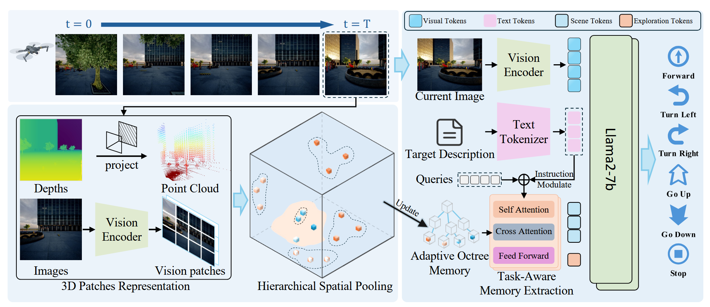
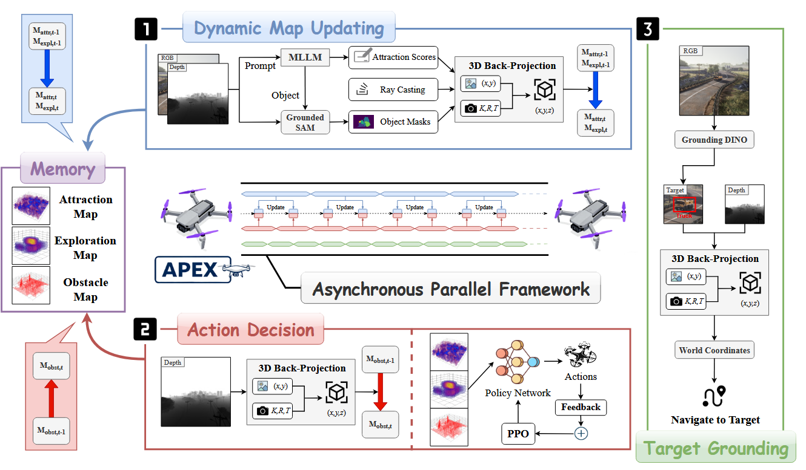
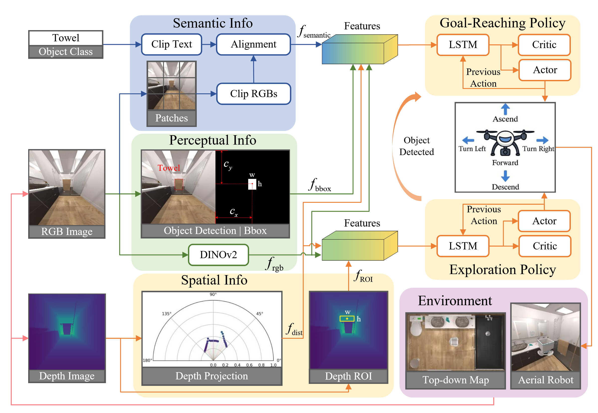
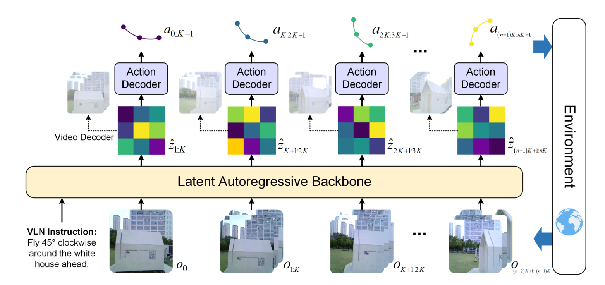
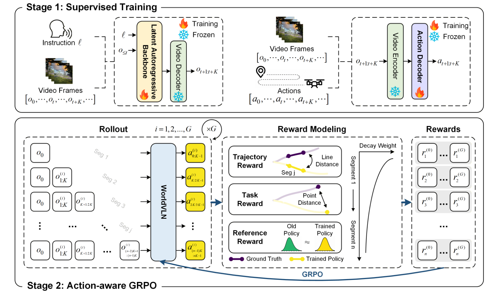

# Aerial Vision-Language Navigation

> **总结**  
> 空中视觉-语言导航（Aerial VLN）要求无人机根据自然语言指令，在开放三维环境中搜索并抵达指定目标物体。当前工作大致分为三类：**End-to-end** 方法（八叉树记忆 + 语言调制检索 + VLM 动作解码）、**Modular** 方法（3D 地图构建与 RL/检测模块解耦、可异步运行）、**World Model** 方法（在隐空间自回归预测环境演化，再解码为导航路点或动作序列）。三类方法在环境表征、目标定位与决策方式上各有侧重，共同指向「语言理解—空间记忆—安全探索—精准抵达」这一核心链路。

---

## 目录

1. [End-to-end Approach](#end-to-end-approach)
2. [Modular Approach](#modular-approach)
3. [World Model Approach](#world-model-approach)

---

## End-to-end Approach

### Memory-Augmented Scene Understanding and Exploration for Open-World Aerial Object-Goal Navigation

*Hangzhou Dianzi University*

> 基于八叉树的三维环境记忆体，通过像素特征与体素映射构建动态栅格，结合语言指令经 FiLM 调制与 Q-Former 实现目标定位与探索边界检索，采用多模态融合决策模块生成导航动作。

#### （1）像素特征-体素映射

在时刻 $t$，输入观测数据 $O_t=\{D_t, V_t\}$（$D_t$ 为深度图、$V_t$ 为 RGB 图像）。先通过视觉编码器提取 RGB 图的图像块 Token 特征，整理为空间网格形式 $\boldsymbol{X}_p \in \mathbb{R}^{h\times w\times d}$。

结合相机内参、外参，再匹配深度图 $D_t$ 的最近邻深度值，把二维图像块反投影到三维世界坐标系，得到坐标矩阵 $\boldsymbol{P} \in \mathbb{R}^{h\times w\times 3}$。

随后使用两层可学习 MLP，将三维坐标编码为同维度的位置嵌入 $\boldsymbol{P}' \in \mathbb{R}^{h\times w\times d}$，最终将二维视觉特征与三维位置嵌入逐元素相加融合：

$$\boldsymbol{X}_{3D} = \boldsymbol{X}_p + \boldsymbol{P}'$$

算法将滤波后的点云 $\hat{P}$ 按机器人距离划分为多层尺寸各异的体素网格。设距离分段集合 $D = \{[d_0, d_1), [d_1, d_2), \dots, [d_{K-1}, d_K]\}$，其中 $d_0=0$、$d_K=d_{\rm max}$，每一个区间 $[d_{k-1},d_k)$ 对应唯一体素尺寸 $s_k$，且 $s_1<s_2<\dots<s_K$。

在单个体素 $v$ 内部，对落在该体素里的全部三维点坐标与图像块特征做均值池化：

$$x_v = \frac{1}{|I_v|}\sum_{i\in I_v}x_i,\quad p_v = \frac{1}{|I_v|}\sum_{i\in I_v}p_i$$

#### （2）特征增量式更新八叉树栅格

聚合得到的特征集合 $\boldsymbol{X}_{\rm agg}$ 与坐标集合 $\boldsymbol{P}_{\rm agg}$ 会增量式存入基于八叉树的全局环境记忆体 $M_t$。

- **初始时刻 $t=0$**：利用首轮聚合点云构建初始八叉树，每个栅格 $c$ 初始特征 $m_c^{(0)}=x_i^{(0)}$，得到 $M_0=\{m_c^{(0)}|c\in C_0\}$。
- **后续时刻 $t>0$**：新聚合点匹配到已有栅格则均值更新；落到空白区域则新建栅格 $c'$，特征初始化为 $m_{c'}^{(t)}=x_j^{(t)}$。

最终生成更新后的全局记忆 $M_t=\{m_c^{(t)}|c\in C_t\}$。

#### （3）指令引导的记忆查询

依据导航自然语言指令 $I_\mathrm{goal}$，从八叉树全局环境记忆 $M_t$ 里筛选任务相关环境特征：

1. 初始化可学习查询向量 $\boldsymbol{Q}\in\mathbb{R}^{N_q\times d}$；
2. 用语言编码器编码 $I_\mathrm{goal}$，得到指令向量 $\boldsymbol{e}_I$；
3. 经两层线性映射生成 FiLM 调制参数 $\boldsymbol\gamma(\boldsymbol{e}_I)$、$\boldsymbol\beta(\boldsymbol{e}_I)$，得到任务定制查询 $\boldsymbol{Q}_\mathrm{task}=(\boldsymbol{1}+\boldsymbol\gamma(\boldsymbol{e}_I))\odot \boldsymbol{Q}+\boldsymbol\beta(\boldsymbol{e}_I)$；
4. 用 $\boldsymbol{Q}_\mathrm{task}$ 经 Q-Former 从 $M_t$ 做跨注意力检索。

查询拆成两类互补 token：$\boldsymbol{Q}_\mathrm{scene}$（场景定位）与 $\boldsymbol{Q}_\mathrm{explore}$（探索边界）。以距离阈值 $d_b$ 划分近场 / 远场记忆：

$$\begin{cases} M_\mathrm{near}=\{m_c^{(t)}\in M_t\mid \mathrm{dis}(c)<d_b\} \\ M_\mathrm{far}=\{m_c^{(t)}\in M_t\mid \mathrm{dis}(c)\ge d_b\} \end{cases}$$

- $\boldsymbol{Q}_\mathrm{scene}$ 与 $M_\mathrm{near}$ 交叉注意力，聚焦近处目标物体；
- $\boldsymbol{Q}_\mathrm{explore}$ 与 $M_\mathrm{far}$ 交叉注意力，引导前往未知区域搜索。

经 L 层 Transformer 迭代后，输出 $\boldsymbol{Q}_\mathrm{scene}^{(L)}$ 与 $\boldsymbol{Q}_\mathrm{explore}^{(L)}$，拼接并线性投影得到记忆特征 $\boldsymbol{H}_\mathrm{mem}$。

#### （4）多模态融合决策

对当前 RGB 观测 $V_t$ 提取 $\boldsymbol{H}_\mathrm{obs}$，对指令 $I_\mathrm{goal}$ 提取 $\boldsymbol{H}_\mathrm{lang}$，三类特征在序列维度拼接：

$$\boldsymbol{H}_\mathrm{input}= \big[\boldsymbol{H}_\mathrm{lang},\boldsymbol{H}_\mathrm{obs},\boldsymbol{H}_\mathrm{mem}\big]$$

遵照 OpenVLA 范式，送入预训练 VLM 主干网络，输出动作 token，再解码为离散导航动作 $a_t\in \mathcal{A}$。

---

## Modular Approach

### APEX: A Decoupled Memory-based Explorer for Asynchronous Aerial Object Goal Navigation

*Harbin Institute of Technology, Shenzhen*

> 通过 3D 反投影生成物体吸引地图（语义关联评分）、探索地图（观测密度）及障碍物地图，结合 CNN 特征提取与多奖励强化学习决策，异步执行目标定位与导航，利用开放词汇检测实现精准目标追踪。

#### （1）3D 反投影

将 2D 深度图像转换为世界坐标系下的 3D 点云，通过相机内参 $K$、像素深度值与智能体位姿 $S_t$，把 2D 像素映射为 3D 空间点，再栅格离散化到 3D 地图 $M$。

#### （2）物体吸引地图 $M_{\mathrm{attr}}$

量化观测物体与导航目标的语义关联程度，指导智能体判断哪些区域更可能找到目标。

1. **语义解析与打分**：MLLM 输入观测 $O_t$ 与目标描述 $D$，输出物体描述与吸引力分数 $\{(c_i, s_i)\}_{i=1}^N$；
2. **开放词汇分割**：对每个 $c_i$ 生成物体掩码 $\mathrm{Mask}_i=\mathrm{SEG}(O_t,c_i)$；
3. **3D 投影与更新规则**：
   - **主体归属**：同一体素归属投影像素最多的物体；
   - **近距优先**：仅当新观测更近时才更新体素。
4. **体素更新**：设新分数 $s_{\text{new}}$、新深度 $d_{\text{new}}$，仅当 $d_{\text{new}} < M_{\text{depth}}(v)$ 时覆盖原有数据。

#### （3）探索地图 $M_{\mathrm{expl}}$

记录各空间区域的观测密度。由深度观测得到 3D 点集 $P_w$，以相机位置向每个点发射探测光线，合并得到可视体素 $V_{\text{visible}}$。

单步探索增量：

$$\Delta M_{\text{expl}}(v) = \exp \big(-\lambda \cdot \| p_v - t_t \|_2\big)$$

累加更新：$M_{\text{expl},t}(v) \leftarrow M_{\text{expl},t-1}(v) + \Delta M_{\text{expl}}(v)$，智能体优先选择低分未知区域。

#### （4）障碍物地图 $M_{\mathrm{obst}}$

基于 3D 反投影构建占用空间，用于路径规划与安全避障：

$$M_{\text{obst}}(v) \leftarrow 1 \quad \text{if } v \text{ contains any } P_w$$

#### （5）基于强化学习的动作决策

三类地图分别经独立 CNN 提取特征后拼接，奖励包括：稀疏奖励（成功/失败）、吸引力奖励、探索奖励。

#### （6）目标定位

开放词汇检测模型 $\mathrm{GD}(\cdot)$ 对 RGB 观测 $O_t$ 检测目标：

$$\{(\text{bbox}_j, \text{conf}_j)\}_{j=1}^K = \mathrm{GD}(O_t, D)$$

最高置信度超过阈值时，调用重建投影器 $\mathrm{RP}(\cdot)$ 解算目标世界坐标 $P_{\text{target}}$。

#### （7）异步并行框架

地图更新与行动决策在不同频率下并行运行；障碍地图逐步更新，吸引力与探索地图可能保持不变。

---

### AION: Aerial Indoor Object-Goal Navigation Using Dual-Policy Reinforcement Learning

*National University of Singapore*

> AION 通过双策略强化学习实现室内无人机目标导航：CLIP 生成语义相似度图定位目标；深度投影生成障碍物距离特征避障；深度点云提取 ROI 引导探索。目标抵达策略与探索策略分别设计多维奖励，实现安全高效的目标搜寻。

#### （1）跨模态注意力

CLIP 将 RGB 图像块 $\{p_i\}_{i=1}^N$ 与目标文本 $c_t$ 编码，计算余弦相似度构成语义相似度图 $f_{\text{semantic}}$，标识与目标关联度最高的视觉区域。

#### （2）深度投影避障模块

深度图 $I_{\text{depth}}$ 经逆投影与位姿变换得到机体坐标系点云 $\boldsymbol{P}_{\text{body}}$，高度滤波后转为极坐标并按方位角划分为 $N$ 个扇区，每个扇区取最近障碍距离 $\rho^k_{\min}$，拼接为激光扫描特征：

$$f_{\text{dist}} = [\rho^1_{\min}, \dots, \rho^N_{\min}] \in \mathbb{R}^N$$

#### （3）深度感兴趣区域探索

从 $\boldsymbol{P}_{\text{body}}$ 反向投影至图像平面，筛选深度高位区间的最大连通区域作为 ROI，输出特征 $f_{\text{ROI}} = [d_x, d_y, \bar{z}_{\text{ROI}}]^\top$。

#### （4）目标抵达 Policy

奖励包括：趋近奖励、关联物体奖励、包围框奖励、任务成功奖励、碰撞惩罚与单步惩罚。

#### （5）探索 Policy

奖励包括：前进奖励（ROI 深度变化）、方向奖励（ROI 中心偏移）、安全奖励（障碍距离）与单步惩罚。

---

## World Model Approach

### WorldVLN: Autoregressive World Action Model for Aerial Vision-Language Navigation

*Tsinghua University*

> WorldVLN 基于自回归 Transformer，融合环境隐特征预测与动作生成，采用闭环迭代推理输出导航路点。训练分为监督学习与改进版 GRPO 强化学习两阶段，结合轨迹、任务与参考奖励优化策略。

生物空间智能表明导航本质上是预见性的：人类隐性预测运动的状态后果，并选择预期使最终状态更接近目标的行动。世界动作模型将潜在世界预测与动作生成结合，从预测的未来中恢复动作，或直接从世界表示中解码动作。

智能体接收自然语言指令 $l$ 后，在三维环境中连续执行动作；第 $t$ 步预测路点动作 $a_t \sim \pi_\theta(\cdot \mid o_{\le t}, a_{\lt t}, l)$，其中 $a_t = (\Delta x_t, \Delta y_t, \Delta z_t, \Delta \psi_t)$。执行后更新位姿 $q_{t+1} = q_t \oplus a_t$，再获取新观测 $o_{t+1} = \Omega(q_{t+1})$。当最终位置与目标距离小于 $\varepsilon$ 时判定成功。

WorldVLN 采用预训练隐空间自回归视频 Transformer 作为环境主干，**并不将隐特征还原为视频画面**，而是将其解读为短时序环境状态转移。主干由文本编码器 $\psi$、视频 VAE $\mathcal{E}_{\text{vid}}$ 与隐空间 AR Transformer $p_\theta$ 构成。下一阶段隐特征序列通过 $\hat{z}_{t+1:t+K} \sim p_\theta (\cdot \mid e_l, z_{\le t})$ 预测，再经动作解码器输出：

$$a_{t:t+K-1} = \mathcal{D}_\varphi (\hat{z}_{t+1:t+K})$$

执行动作后获取真实观测并编码为 $z_{t+1:t+K}$，用真实隐特征替换预测值，形成闭环迭代：

$$(e_l, z_0) \rightarrow \hat{z}_{1:K} \rightarrow a_{0:K-1} \rightarrow o_{1:K} \rightarrow z_{1:K} \rightarrow \hat{z}_{K+1:2K} \rightarrow \cdots$$

#### （1）阶段一：监督训练

**世界模型损失**（隐特征预测）：

$$\mathcal{L}_{\text{wm}} = -\sum \log p_\theta \big(z_{t+1:t+K} \mid e_l, z_{\le t}\big)$$

**动作解码器损失**（拟合专家轨迹）：

$$\mathcal{L}_{\text{act}} = \sum \big\| \mathcal{D}_\varphi \big(\mathcal{E}_{\text{vid}}(o_{t+1:t+K})\big) - a^*_{t:t+K-1} \big\|$$

#### （2）阶段二：动作感知 GRPO 强化训练

对每条任务采样 $G$ 组在线推演轨迹，第 $i$ 条轨迹第 $j$ 个动作片段的奖励为：

$$r^{(i)}_j = \gamma^{j-1} \lambda_{\text{traj}} r^{(i)}_{\text{traj},j} + \lambda_{\text{task}} r^{(i)}_{\text{task},j} + \lambda_{\text{ref}} r^{(i)}_{\text{ref},j}$$

- **轨迹奖励**：衡量预测动作与专家动作的匹配程度；
- **任务奖励**：评估轨迹终点与目标点的距离；
- **参考奖励**：约束策略不偏离基准策略过远。

组内归一化得到优势函数 $A^{(i)}_j$，再用截断 GRPO 目标更新策略：

$$J_{\text{GRPO}} = \mathbb{E}_{i,j}\Big[ \min\Big(\rho^{(i)}_j A^{(i)}_j,\ \text{clip}\big(\rho^{(i)}_j, 1-\varepsilon_{\text{clip}}, 1+\varepsilon_{\text{clip}}\big) A^{(i)}_j\Big) \Big]$$

其中 $\rho^{(i)}_j = \dfrac{\pi_\theta(a^{(i)}_{(j-1)K:jK-1} \mid h^{(i)}_j)}{\pi_{\text{old}}(a^{(i)}_{(j-1)K:jK-1} \mid h^{(i)}_j)}$。
